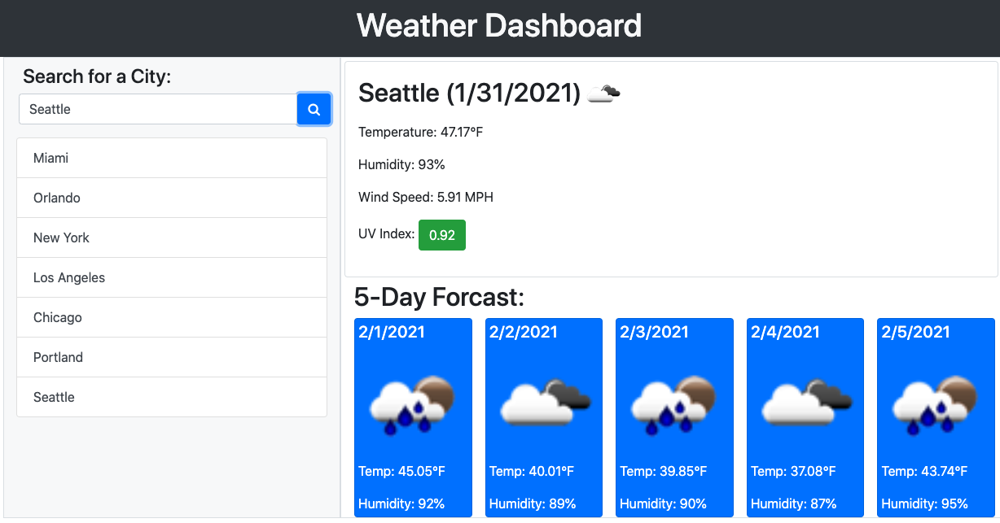
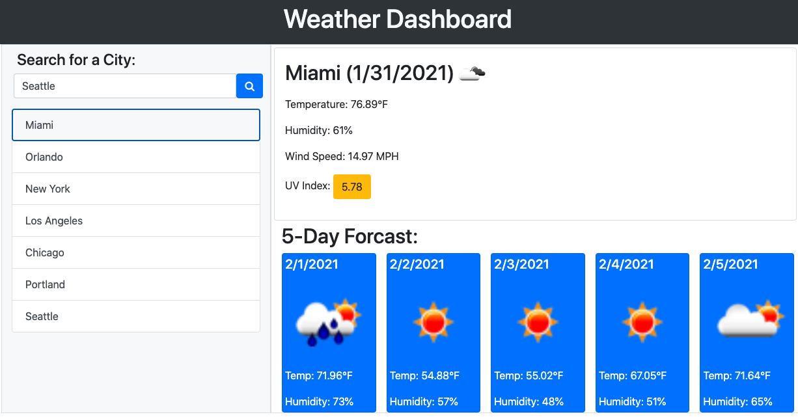

# Weather-Dashboard

## Description
Weather Dashboard is an interactive weather app that lets you search a city to see its weather using the OpenWeather API. When you search a valid city you see its current weather including temperature, humidity, wind speed and UV index. The UV index is presented with a color, showing you if the conditions are favorable (green), moderate (yellow), or severe (red). Also when you search you see a five day forecast including an icon showing the projected weather, the temperature, and humidity. The app also saves your city searches so you can click on them again to render the current weather and 5 day forecast. This uses local storage to complete this task. If you do not enter a city but hit the search button you will be prompted to enter a city. If your city search does not match a city with the OpenWeather Api you will be prompted to try again. If OpenWeather is down you will recieve a message saying OpenWeather is down and to try again. Failed searches will not be saved into local storage or rendered at clickable buttons. HTML, Javascript, Bootstrap, and Font Awesome were used to build this page.

Come see the finished product! https://mrhumpherys.github.io/Weather-Dashboard/